# PE2022_Team 1

## Members
+ Bui Nhien Loc (15635) (Team leader)
+ Bui Le Phi Long (16619)
+ Dinh Cong Minh (16047)
+ Tran Ngan Thao (16301)
+ Duong Ngoc Thao Dan (16079)
+ Nguyen Anh Tai (16128)
+ Cao Xuan Hai (16140)

## Project: Pharmacy Management System

This project aims to develop an application for the effective management of a pharmaceutical store. It helps the pharmacist to maintain the records of the medicines/drugs and supplies sent in by the supplier. The admin who is handling the organization will be responsible to manage the record of the employee. Each employee will be given a separate username and password. The users can communicate with each other by using a built-in messaging system. The pharmacy management system deals with the maintenance of drugs and consumables in the pharmacy unit. Its application can generate invoices, bills, receipts, etc.

## Acknowledgements
During this project, the tasks were divided as shown in the following table:

 |       **Task**     | Loc|Minh|Long|Thao|Ngoc|Dan|Tai|Hai|
|--------------------|----|----|----|----|-|-|-|-|
|Write documentation |x   |x   |x   |x   | |x|x|x|
|Prepare slides for presentation |x   |x   |x   |x   | |x|x|x|
|User interface (Front-end)|x|||||x||x|
|Design overall structure|x|x|x|x|x|x|x|x|
|Draw diagrams|x|x|x|x|x|x|x|x|
|Login and create account| | | x| | | | | |
|Firebase| | |x| | | |x | |
|Database| |x| |x| | | | |
|Storage Management| |x| | | | | |x|
|Messaging function| | | | | |x |x | |
|Export and import product|x|x| | | | | |
|Report generator| | | |x| |x| | |
|Dockerfile| | | | |x| | | |

## Introduction

 ### Objective

This final report for the Programming Exercise Project, MediMe, is submitted to partially satisfy the requirements of the Programming Exercise course at Vietnamese-German University and includes a technical description and architecture of the program, and the data flow diagram through the program. Our goal is to realize MediMe as a web-based platform that big-chain pharmaceutical companies can use to manage their products. This will bring people a quality user experience for employees and managers, especially during the Monkeypox outbreak is approaching..

 ### Audience

The intended audience of this document is the course instructor, Prof. Huynh Trung Hieu, who will use it for the evaluation and determination of a portion of the grade for the course.

 ### Project Scope

This report has been written to familiarize the audience with the features of the program while presenting the schedule and progress of the project. A detailed explanation of the framework used and the applications and functions are not included in this report. To mark this project as a success, we have to achieve the following requirements:

1. *Log in* and *authentication* for **Admin** and **Employees**.

2. *Create*, *Update* and *Delete* a new account (only for **Admin**).

3. **Product** *distribution*.

4. Private **Messaging** system (include *send*, *read*, and *view* messages).

5. *Generate* daily reports (Total sales of the day for **Employees**)

6. *Generate* monthly reports (Import and export products for **Admin**)

7. *Notify* **Employees** about *expiring* or *out-of-stock* **Products**.

 ### Constraints
During our time working as a team, we encountered the following setbacks:

* Lack of experience in working with industry and professional projects.

* Inefficient in working with Firebase and JavaScript.

The project is expected to be completed in 9 weeks. Progress is documented below. The process has been very smooth, with only minor setbacks along the way. Nevertheless, we believe that there is room for improvement in this project. With an extended deadline, the project can become a full-fledged website application.

## Product Backlog
Use Type: E-Employee, A-Admin, S-System;

Categorized: F-Functional, N-Nonfunctional.
|No|Initial Requirement|Extended Requirement| Description | Priority | Sprint | Use type | Functioning|Business Value|
|--|-------------|-------------|-----------|-------------|---------|---------|------|--------------------------------|
|1|User Creation and Management|- Add account - Sign in/Sign out - Edit Profile - Management|- A new branch is formed and needs an account - Users can sign in or sign out of the system - User wants to modify the personal information - Managing employee’s account for Administrator| - High  - High - High - High|- 2 - 2 - 3 - 3 | - A - E,A - E,A - A | - F   - F - F - F |This is a private app, so having an account is essential for access and security. This makes account creation exclusively an Admin’s function.|
|2 |Storage for Medicine Management |- Data table for medicine and drugs - Data searching for the storage system - Checking for medicine’s status|- A table that includes the name, id, and the amount in stock for each drug. In the case of Admin, choose which branch they want to check out - An easily accessible table is without its search function - Check to see whether or not the product is out of stock, nearly out of stock, expired, or nearly expired|- High - Med  - Med|- 3 - 3 - 3 | - E,A  - E,A - S|- F - F - F |An important part of a management system. With an easy view of the amount of each product and its product, a good storage system can go a long way for a company.|
|3 |Importing and Exporting Medicine |- Exporting - Importing|- The employee makes a sale and updates it to the system and makes an invoice from it - Admin replenish out-of-stock and expired medicine in a certain branch|- High - High|- 4 - 4| - E - A|- F - F |A management system is without updating the amount on a whim and saves it to the system.|
|4 |Messaging System |- Direct messaging - Group messaging|- Communi- cate between employees or between employees and Admin - Create a group chat that includes both employees and Admin|- High - Med|- 4 - 4| - E,A - E,A|- F - F |Communication is key to a successful company, MediMe provides this to breach the gap between users.|
|5 |Generating Report |- Daily report - Monthly report|- Generate a report for the day for an employee to keep track of their progress - Unlike a daily report, this report is exclusive for Admin and is generated at the end of every month|- High - High|- 4 - 4| - S - S|- F - F |For any business venture, keeping track of profit and spending is crucial. To do this, a report is generally the way to go.|
|6 |Notification |Notification|Notify about medicine’s status|Low||S|N |For future development.|
## Project Overview
### Overall Architecture
MediMe project is created under one of the state-of-the-art approaches for a web application, the Model-View-Controller. Database access is established via many layers of service. For this approach, the user can easily communicate with the server or database through a controller.

### Brief Description of Firebase Framework
The project is created as a web-based application, with an integrated graphical user interface for users and Admins to access their respective functions. Firebase is a Backend-as-a-Service. It provides developers with a variety of tools and services to help develop apps, and grow their user base. It is built on Google’s infrastructure.
Firebase is implemented in this project due to its capability in providing some key features:

-  Authentication: It supports authentication using passwords, phone numbers, Google, Facebook, Twitter, and more. The Firebase Authentication (SDK) can be used to manually integrate one or more sign-in methods into an app
- Cloud Database: Cloud Firestore is a NoSQL document database that lets developers easily store, sync, and query data for their mobile and web apps - on a global scale.

### Use case diagram
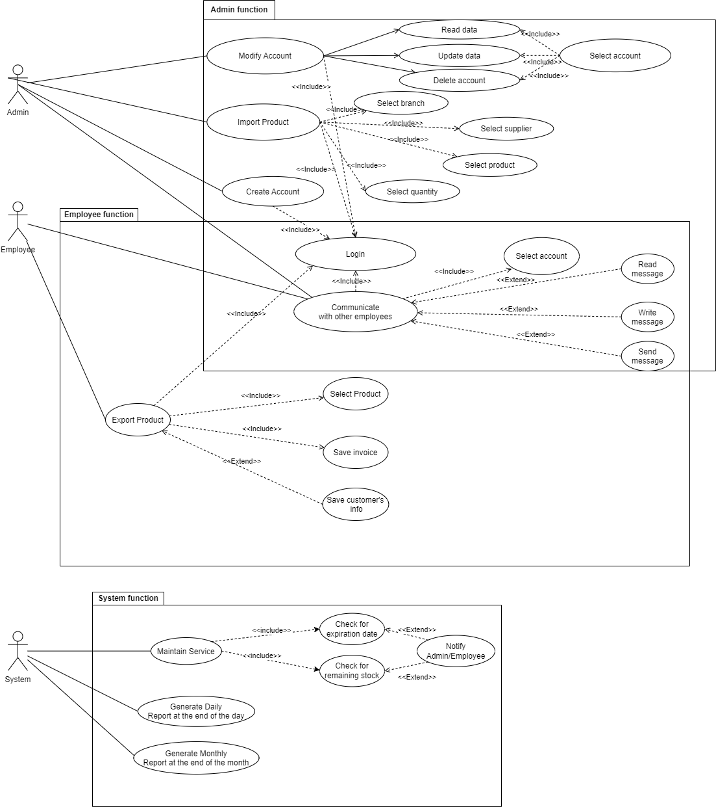

This web application was deployed as a private system to manage the business activities of a franchise of pharmacies.

In the interest of security, the administrator is the only actor being granted the right to create a new account for the employees - the new store of the franchise. In addition, only the administrator is assigned to account modification roles including removing and updating the information of the employees. In addition, the web application allows both Admin and employees to log in to their respective accounts.

Concerning the messaging function, the user can first interact with other users via a messaging system including reading, writing, and sending messages. To find the recipients, the users can search through the user information list displaying the active and inactive users. Otherwise, they can filter the recipients by name, which returns the targeted recipient the users want. Besides, the user can create a group chat and add the description for the group chat so that other users can know in detail the purpose of the group. The user would be able to add new members to the group chat and start the conversation within the chat room. Moreover, whenever there is a new message from other users, the current user would be notified immediately.

With regards to records management, whenever there is a transaction from the customers, so-called product exportation, and the suppliers, so-called product importation, the details of the orders would be saved in the system. More specifically, the employee in charge of selling the products can select the product and fill in the information about the purchases. After that, the invoice and customers' information would be recorded in the system. Regarding the importation of new products, the administrator would select the branch that the goods are to be imported, the supplier of the product, the information of the targeted products as well as the quantity that is required.

For timely business activity tracking, the system is an actor who regulates the current conditions of the existing products. The warning regarding the expiration date and out-of-stock products would be notified to the Admin and employees on necessity. To manage the business, a daily report and monthly report would be sent to the administrators.

### ER Diagram

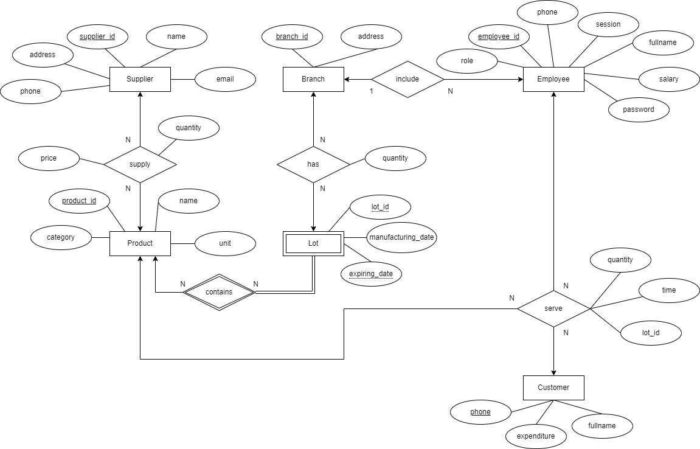

### Class Diagram

 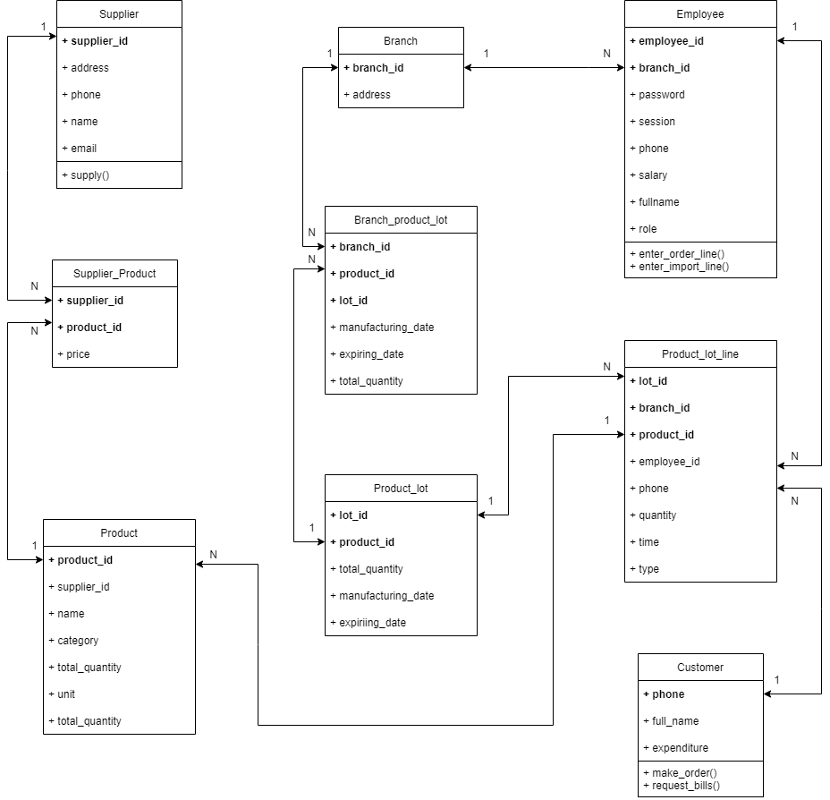 

## Software

### User Interface

 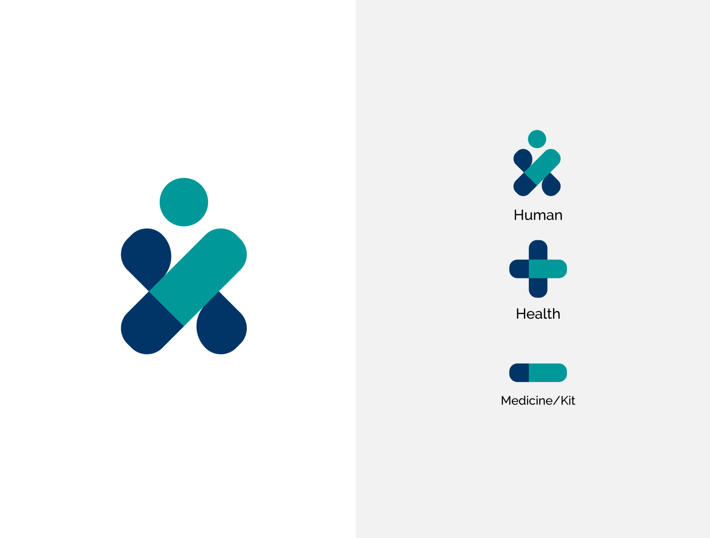 

After having a group discussion, we decided that our approach is to design a web application focusing mostly on people who are currently at a certain age and have a lack of experience in technology and the internet. Hence, we have to choose a logo that not only represents the quality of the product but also means that we work for the people. That is why we decided to use the current logo for the MediMe pharmacy management system. The name MediMe itself can be divided into 2 phrases which are "Medi" for medicine and "Me" for the people. We use ReactJS and CSS for the overall design of the system. If ReactJS works as a skeleton of the system, CSS will work as the skin - show exactly what our product looks like. Most of the icons, buttons, banners, and cards in the system are self-designed; some were taken from Box-icons or Ant designs framework. For 9 weeks of the project, we try to stick to the WYSIWYG concept (what you see is what you get) to design an intuitive system for users to experience without having any problems. The members of the front-end team will discuss and find inspiration online to acquire the most suitable design for the system, then sketch the prototypes on Figma for better visualization. Subsequently, we will design the actual product based on it.

### Database
#### Database Management System
For our project, we decided to use PostgreSQL as our DBMS because it is a powerful and reliable open-source object-relational database system, which provides us with what we need to manage our data.

As being a SQL system, PostgreSQL allows us to retrieve data faster and more efficiently via queries, especially with a large amount of data needed to be handled in our project.

An SQL-based system like PostgreSQL provides us the ability to enhance our data integrity by using constraints and triggers. This will be mentioned more clearly in the next sections.

The next important thing about our database is ElephantSQL. It is a PostgreSQL database hosting service which will give us 20Mb of database storage for free. As an online host service, ElephantSQL allows us to cross-working by inviting other people to access the database, so that our team members can test and query data separately so that the efficiency will be higher.

#### Implementing Database
Our database is created by mapping from ER diagram as shown in the previous part, to the Relational Database diagram. However, the first version of the database was poor and it was quite hard for our back-end team members to query. For satisfying user requirements as well as make it simpler for the members to work with the database, the next version of the database is developed. In this version, we have kept all the tables from the previous version while adding new attributes to some tables, coming with new user-defined SQL functions and triggers.
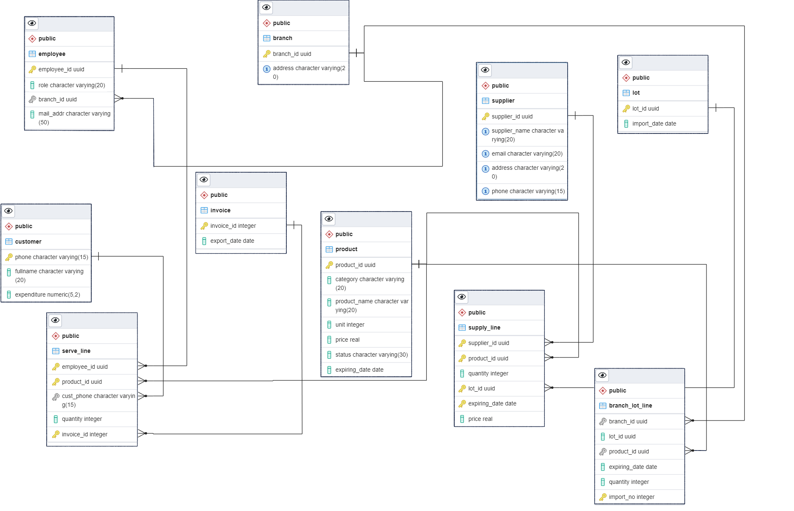

The database consists of 10 tables as follows:

    - Product(<ins>product_id</ins>, category, product_name, unit, price, status, expiring_date)

    - Supplier(<ins>supplier_id</ins>, supplier name, email, address, character, phone)

    - Lot(<ins>lot_id</ins>, import date)

    - Branch(<ins>branch_id</ins>, address)

    - Employee(<ins>employee_id</ins>, role, branch\_id, mail\_addr)

    - Customer(<ins>phone</ins>, fullname, expenditure)

    - Invoice(<ins>invoice_id</ins>, export\_date)

The tables above are to record the "entities" of our database, while the next 3 tables are to record the changes when importing and exporting the products to the system:

    - Supply_line(<ins>supplier_id, product_id, lot_id, expiring date </ins>, quantity, price): this table is to record the action of importing products from a supplier to the system.

    - Branch_lot_line(<ins>import_number</ins>, branch_id, lot_id, product_id, expiring_date, quantity): this table is to record the action of importing product from system to a specific branch.

    - Serve line(<ins>employee_id, product_id, invoice id</ins>, cust phone, quantity): this table is to record the action of selling a product to a customer.

Besides the table, another very important factor of the database is the triggers and functions. In our database, we have defined 14 functions, while 9 among them are trigger functions, which will be stated further in the next section. The remaining 7 functions are:

    - get_remaining_quantity(br_id uuid, prod_id uuid): This function will return the remaining quantity of a product in a branch by taking the branch id and product id as parameters. The algorithm for this function is quite simple, as we just have to take the subtraction between the quantity imported to the branch and the sold quantity from that branch of the given product.

    - get_product_expiring_date(br_id uuid, prod_id uuid): This function will return the expiring date of a product of a branch. The return expiring date is defined as the nearest expiring date, or the min expiring date of a product, as there will be the case that the Admin will import the product from several lots with different expiring dates to the branch. To calculate it, we define a rule that for a branch, when selling a product, the nearest expiring date ones will be exported first, then we just have to compare the sold quantity of a product to the quantity of that product but of different expiring dates, then we can decide the expiring date based on the quantity range that the sold quantity has fallen into.

    - get_product_status(br_id uuid, prod_id uuid): This function will return the status of a product in a branch. We checked the status of the product in the following order:
      - If the remaining quantity = 0 then the status is 'OUT OF STOCK'
      - If the remaining quantity < 10 then the status is 'NEARLY OUR OF STOCK'
      - If the expiring date - the current date <= 0 then the status is 'OUT DATED'
      - If the expiring date - the current date < 10 (days) then the status is 'NEARLY OUT DATE'
      - Else the status is 'NORMAL'

    - get_product_expiring_date_admin(prod_id_uuid): This function also gets the expiring date of a product but in the whole system rather than a single branch. For this function, we have spotted 3 cases:
      - The first case is when the Admin imported the product from the supplier to the system but has not exported it to any branch. Then the function will return the min expiring date of the product in the system found in the supply_table.

      - The second case is when all the imported products from the supplier have been sent to the branches. Then the expiring date of the product is the min expiring date of that product among the expiring dates we got from all the branches that the product has been exported to.

      - The final case is when the product is exported to the branches partly, then there exists some product remaining in the Admin system. Then the expiring date now is the min(expiring_date_remaining_in_system, expiring_date_among_branches). The second one can be found similarly to the second case, while the first one is more complicated. We have to find out the expiring dates of the product that is exported in the branch_lot_line table, and all the expiring dates of that product in the supply_line table. The 2 sets are S1 and S2 respectively. Then we take the subtraction of 2 sets, S2 - S1, and get the expiring dates that are not exported. The expiring_date_remaining_in_system is the min expiring date of that set.

    - get_product_status_admin(prod_id uuid): This function is like the same as the get_product_status(br_id uuid, prod_id uuid) function, but for Admin and it uses the function get_product_expiring_date_admin(prod_id_uuid) instead.

    - update_product_status_admin(): This function is to update the status of all product, it calls the function get_product_status_admin(prod_id uuid) for updating.

    - calculate_invoice(inv_id_int): This function is simply used to calculate the money got from selling a product, based on the invoice id.

#### Managing and Maintaining Database Consistency
To maintain the consistency of our database, a various method has been used, but mainly CONSTRAINT and TRIGGER

As shown in the Relational Database Diagram, our constraints are mainly PRIMARY KEY and FOREIGN KEY, where the PRIMARY KEY attributes are presented by the yellow key in the diagram and the FOREIGN KEY attributes are presented by the lines. Another CONSTRAINT that we used is the UNIQUE constraint. We also defined the constraint UNIQUE on the address attributes and the phone number attributes. In this database, the id attributes except invoice_id are of the type UUID, which will be automatically created by the built-in function uuid_generate_v1() of PostgreSQL for the referenced ids.

Another way that we have used to maintaine consistency is the TRIGGER and TRIGGER FUNCTION. In PostgreSQL, we can not directly put code in the TRIGGER but execute the TRIGGER FUNCTION. Then we have defined our 7 trigger functions ourselves. The detailed functions can be found in the database.sql script file. The functions and triggers are:

    - FUNCTION : import_from_supply()
    TRIGGER: import_product
    triggered when: after insert on Supply_line
    This function automatically updates the unit of the product when the admin imports the product from the supplier to the system.

    - FUNCTION : export_to_customer()
    TRIGGER: export_product_customer
    triggered when: before insert on Serve_line
    This function automatically updates the unit of the product when a product is sold to a customer.

    - FUNCTION : check_exist_supply()
    TRIGGER: check_exists
    triggered when: before insert on Branch_lot_line
    This function is to prevent the insertion on the Branch_lot_line table of the tuple that have the combination of product_id, lot_id, expiring_date that did not appear in the Supply_line table.

    - FUNCTION : calculate_import_price()
    TRIGGER: calculate_price
    triggered when: before insert on Supply_line
    This function automatically calculates the price of importing products to the system.

    - FUNCTION : check_expiring_date()
    TRIGGER: check_expire
    triggered when: before insert on Supply\_line
    This function is to check whether the expiring date of a product is larger than the import date of the lot containing it or not.

    - FUNCTION : check_quantity_branch()
    TRIGGER: check_quantity
    triggered when: before insert on Branch_lot_line
    This function is to check whether the quantity of product being exported to a branch is larger than the remaining quantity in the system.

    - FUNCTION : check_quantity_export()
    TRIGGER: check_quantity
    triggered when: before insert on Serve_line
    This function is to check whether the quantity of product being sold is different from 0 or not.

### Login and Create a new account
#### Login

Firebase’s authentication allows users to log in or create an account with Google, or Facebook, but in this application, those  functionalities will be disabled. Users are only allowed to join the system with an account that is provided by an Admin.

This application also specifies the user/Admin role of each account when logging in to the system. The system will redirect users to the equivalent site based on the role of the account. The login page is the first page users see in the application. It contains two text fields - one for entering a login name and one for entering a password - and a command button that initiates password verification. If either of the text fields is left blank, this is an error that should be communicated to the user. If both fields are filled in, but there is no entry for the user name or the password is incorrect, this must also be communicated to the user.

#### Create new account
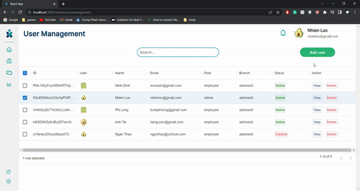

Users without an account will not be able to log in. Users also can not create a new account to access the system like this is a private company's application. The functionality of creating a new account is reserved for only Admin. To do this, the Admin has to log in to their account in the MediMe app, when logging in, on the dashboard page, a unique function 'Manage accounts' that is exclusive to Admin is selectable. This will lead the Admin to a page where they can see all the members in a list. From here, they can choose to view, edit, delete or in this case, create a new account. To do this, they have to select 'Add user', which a window will appear with 4 empty fields for 'Name', 'Branch', 'Email', 'Password', respectively. Fill in all the needed information and press the 'OK' button and a new account has been created, with an email sent to the entered email about the info needed to access the app. On the other hand, if the info is incorrect or invalid, an error window will pop up and let the user knows which information needed to be changed.

### Encryption
Firebase Authentication uses an internally modified version of scrypt to hash account passwords. Even when an account is uploaded with a password using a different algorithm, Firebase Authentication will rehash the password the first time that account successfully logs in. Scrypt is one of the first hashing algorithms implemented on blockchain networks. It is an attempt to improve upon an earlier hashing algorithm. Scrypt is a password-based key derivation function (KDF), generally efficient at preventing brute force password guessing attacks. Scrypt was developed as a solution to mitigate the rise and dominance of ASIC mining rigs and subsequent centralization of cryptocurrency mining Scrypt’s design requires miners to generate random numbers rapidly. These numbers need to be stored in the Random Access Memory (RAM) of the processor, which must be accessed continuosly basis before submitting a result.
### Storage

One of the important factors which differentiate MediMe from other pharmacy management systems. Providing a simple and minimal user interface unlike any other system, employees can keep track of the product easily and conveniently. Thanks to the built-in components - react-table from ReactJS, the product information can be displayed in the form of a table. The data for display is received from the JSON file (which is regularly exported from the database). From the storage, the employee has the freedom to customize what to display on the table by using the following functions which have been implemented for use:

- Sorting: At default, the data will be displayed based on the order of the product in the database. By pressing the column, the data will be displayed in ascending (a to z) or descending (z to a) order. There will be a small notation (up or down arrow), to notify the user that they are currently using the sorting function.
- Search bar: Users can search for a product by using the search bar implemented in the system. The search bar work as a filtering function, but globally. This means that you can search for anything to find the product you want since the limitation now is not only name-searching. (e.g. you can search for products that are nearly out of stock by typing the same phrase into the search bar.)
- Pagination: When there are too many products in a branch, the pagination function will divide the total products into different pages. Users can choose how many products to display on a page, go between pages, go to a specific page, and go to the end of the beginning of the page instantly.
- Row Selection: Additionally, we have created an extra check-box column for users to select products and it will display in detail the information of the product in case of the name of the product is too long to be displayed on the table.
Each product will be provided with a unique ID to distinguish itself from other products; product name; a number of products; the expiry date; the price per unit; and the status which is indicated based on the current stock and the expiry date, using the function get_product_status() to update the status every day and after a number of products is sold:
- If the current stock is below 10: NEARLY OUT OF STOCK
- If the current stock is 0: OUT OF STOCK
- If the expiry date is 10 days close to the current date: NEARLY OUT DATE
- If the expiry date is due: OUTDATED
There is also an "Update Stock" button to update the product stock and status after a certain amount of product have been sold (employee) or when the user wants to import a certain amount of product into a specific branch (admin)

#### From the employee's point of view
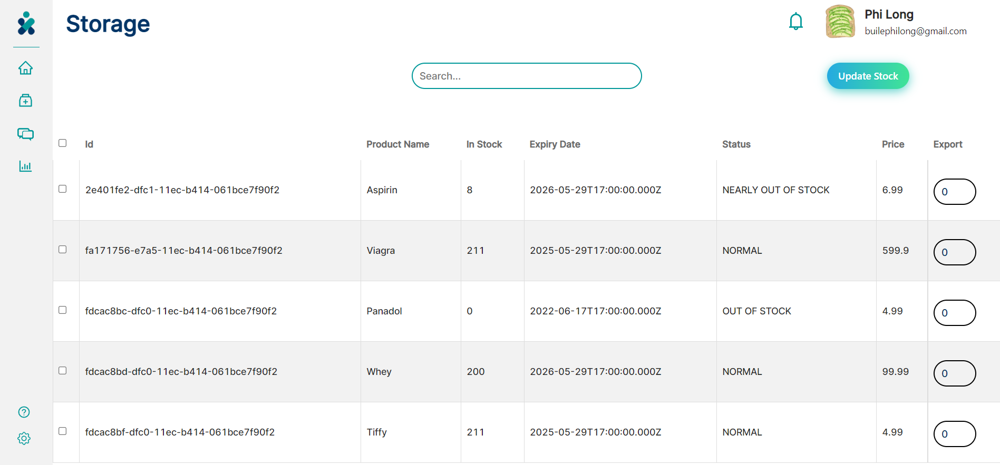
#### From the Admin's point of view
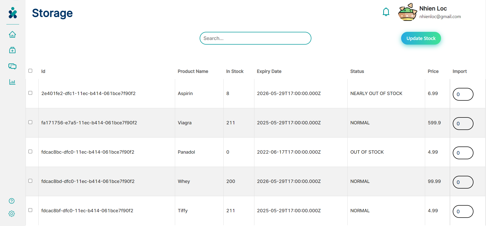
### Import product and export product

Expanding from the storage system, on the same data table, depending on your role, you can have a column for ’Export’ or ’Import’.

#### Import
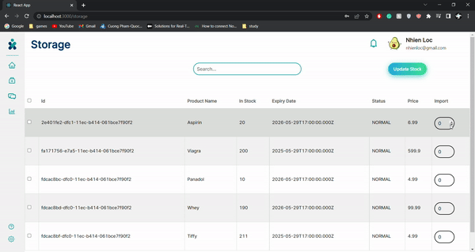

Importing products is an Admin’s exclusive function, as for a real company to stay up-float, only the Admin can import the product and distribute it to the branches. As the storage is running low or the expiring date is approaching, The Admin can access the specific branch’s storage and choose which item and the amount by entering or scrolling the value in the ’Import’ column. By pressing the ’Update Stock’ button, a function from the database will be invoked to update the amount according to the input. This will also invoke the checking for expiration and stock function of the database to display the status of each product.

#### Export
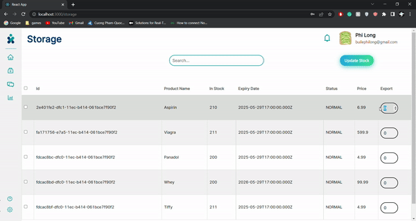

On the opposite end, exporting products is an employee’s exclusive function. From the point of view of the employee, the ’Import’ column from before will be replaced with the ’Export’ column. For real working pharmacies, they can not be sold more than the amount they have in stock, so the front-end will prevent this from happening. To execute the import function, the employee has to input or scroll to the value for each product they have sold. Afterward, by pressing the ’Update Stock’ button, the system will generate a new invoice, and add the sold product’s info along with the amount exported respectively. This invoice is then saved to the database for further reports. The amount and status of each sold medicine are then updated on the table.

### Messaging

After doing research with the customer, it was dictated that the messaging system is used primarily for the staff to communicate the requirements of the customers buying the products. For instance, if one product is out of stock at a specific branch and the customer does require that product in his order, the staff must communicate directly with other staff to find the nearest branch where that product is still available. This is in the interest of increasing customer experience at MediMe. Besides, MediMe does require the integration of group chat so that it would be convenient for the staff, especially the admin to deliver the necessary contents without having to search for every recipient.

After the discussion, there are 6 main components that we would integrate to not only satisfy customer's requirements but also enhance their user experiences. 
- Display of active and inactive users
- Display of recent personal chats and the notification of new messages
- Display of group chats and the notification of new messages
- Adding members to group chat, viewing the room's members, and removing specific members
- Search bars to find the recipients and targeted group chats
- Chat window where the users can send and view their messages

#### Personal messaging
Messaging is a function used by every employee at MediMe, irrespective of their roles. On entering the messaging page, the users can see 5 main components which are recent chat, group chat, chat window, active users display and inactive users display.

All the personal chats between the users would be displayed in the recent chat according to the users' latest chatting history. Thanks to this integration, the user would know which messages come first and not miss out on the newest ones. Besides, the notifications of new messages would be displayed here if the users do not click on the chat box. As a result, the current user would be updated if he received the messages from other senders.

To start the conversation, there are 3 ways that we had integrated to facilitate the user's experience.
- The user can click on the chat box currently existing in the recent chat corner and interact with other users
- The user can click on the recipients displayed in the status corner in order to search for the employees who are currently active to interact with in case of emergencies. In case two users have the same name and avatar, which makes it difficult to differentiate between the recipients. A popover which displays the email and name of the user was integrated because each user was assigned a unique email and password.
- The user can search for the targeted recipients in the search bar if there are many users in the user history. The user just needs to input the name of the recipient in the search bar and find the one they would like to start the conversation with. Likewise, if there are two identical users because of similar names and avatars, the presence of email on hovering would help differentiate among the targeted recipients.

Upon choosing the recipient, the chat window would appear. In the chat window, the user would see 3 components
- The name and status of whom the user is chatting
- The message sending corner where the user can write and send their messages
- The display of chat history including the message content, the sender, and the time the messages were sent

Concerning the mechanism of personal messaging, when the user sends a message, the last message between the two users would be updated in the database. Then, the content of the message would be stored in the message users table in the firestore database. Concurrently, if the two users have never had a conversation before, the information of the new user would be added to the user history table for querying.

#### Group messaging

### Generate report

Reports are considered important documents that can reflect the current situation of our business. As the database stores a lot of data, reports are introduced to provide brief information on what is concerned. In this case, the main focus is on the total sales each day, imports, and exports of each month. Therefore, there are two types of reports that are included in our application which are daily reports and monthly reports. Within our concerns, the daily report contains the information on the total sales of that day, while the monthly report summarizes the information on imports and exports. Since there are many branches in our system, each report is specified for one branch only.

The daily report can be generated by an employee at the end of the day. The necessary information for the report is provided by executing a rather complex query. The report has a list of products with their total quantity that was sold in the day. From the email of the employee, we can get the branch_id of the branch where they are working. Then, we can get the current date by creating a new Date object in Nodejs and then use its day, month, and year for a filter. By joining the Serve_line table, the Invoice table, the Product table, and the Employee table, we get the product name, its price, and the total quantity for each time that product is served. Then we filter the result with the branch_id and the export_date to get the right branch and the right date for the report. The daily report can be exported to PDF format, which is discussed in the next section. 

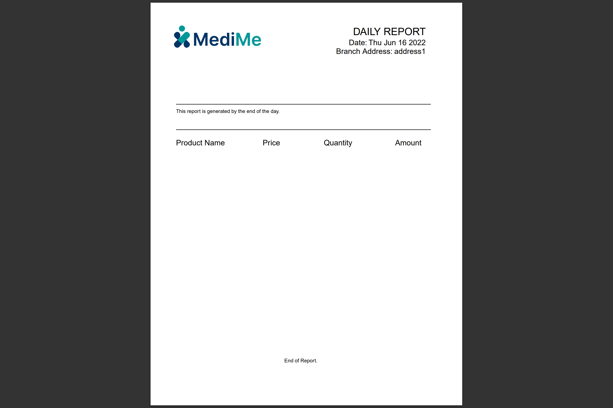

As for the monthly report, we do not want to include too many numbers so we decided to use a line graph to demonstrate the trend in the amount of money for imports and exports. Similar to the case of daily reports, the queries for the information on imports and exports have high complexity. We just need the information on the date and the amount of money for both cases. We need to get the branch_id, the month, and the year of the current date and use them as filters like the daily report. First, we need sub queries on the imports of each time a product is imported to the branch and the exports of each time a product is sold filtered by the month and year and the branch_id. Then, we use the sum function and group the result from the sub queries by date. Finally, we get the day and the total amount of money spend on imports and earn from exports for each day. The data is written to a JSON file for the front-end to read and display as a line graph on the web. The PDF is not supported for this report due to some limitations. 

Furthermore, since the reports only show some significant information, we also include the details on imports and exports for checking inventory. An employee can click on the Details tab to see the details of imports and exports of the branch. The details information is displayed on the web as tables. Users can choose whether they want to see the imports or the exports table. The queries for the information in the tables are simpler compared to the reports queries. By joining multiple tables and selecting the needed column, we can get the information. The data is also written to JSON files for the front-end to read and display as tables.

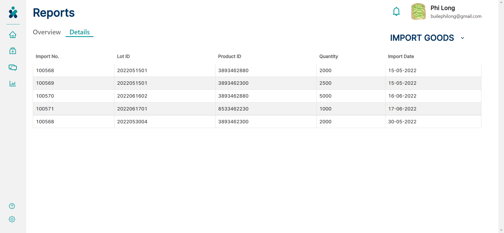

### The export portable document format file

Our app supports the functionality of export the daily reporting as a PDF documents. We use the PDFKit library to generate PDF document. With the information gained from executing the related query, we put them on the PDF file by using the functions provided by PDFKit library. For displaying and allowing users to download the PDF file, the document is pushed to a buffer and then piped to the response of ExpressJS. Similarly, our app supports printable PDF format for invoices too. 

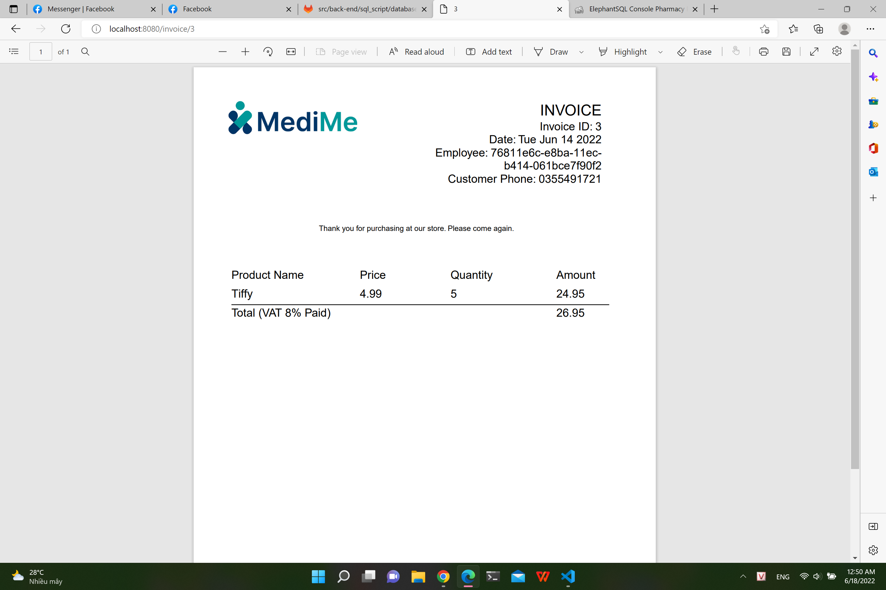

## Conclusion

### Limitation

### Lesson learned

### Future development

## References
- This project is based on the requirements of ["Project 2: Pharmacy
Management System"](https://gitlab.com/galvdat/vgu_tinyprojects/vgupe2022/-/blob/main/Day1.md), 2022, by Prof. Nguyen Trung Hieu.
- Read and learn more about Firebase, [here](https://firebase.google.com/).
- About [Firebase Authentication Password Hashing](https://firebaseopensource.com/projects/firebase/scrypt/).
- Delton Rhodes, ["Scrypt: An Overview of the Scrypt Mining Algorithm"](https://komodoplatform.com/en/academy/scrypt-algorithm/\#how-effective-has-scrypt-been-at-asic-resistance).
- About [ExpressJS](https://expressjs.com/).
- About [ElephantSQL](https://www.elephantsql.com/).
- About [React](https://reactjs.org/).
- About [PDFKit](https://pdfkit.org/).
- [Demo](https://drive.google.com/drive/u/1/folders/1TLH_wRBED4GFLaK6eEc3Ufdu3NIVHbu7)

## Appendix A: Glossary of Terms
CSS: Cascading Style Sheets

SQL: Structured Query Language

DBMS: Database Management System

ER Diagram: Entity Relationship Diagram

KDF: Key Derivation Function

ASIC: Application-Specific Integrated Circuit

RAM: Random Access Memory

JSON: JavaScript Object Notation

ReactJS: React JavaScript

PDF: Portable Document Format
## Appendix B: Scrum review

### Report
#### Sprint 1

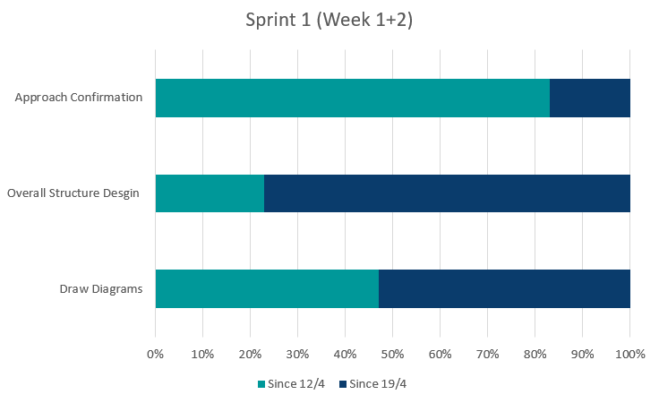

#### Sprint 2

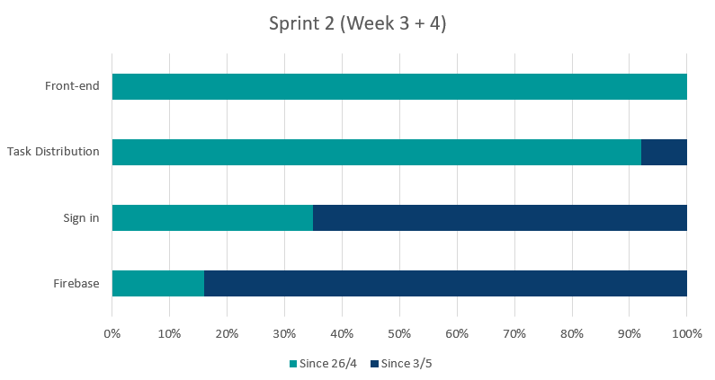

#### Sprint 3

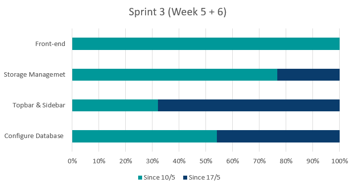

#### Sprint 4

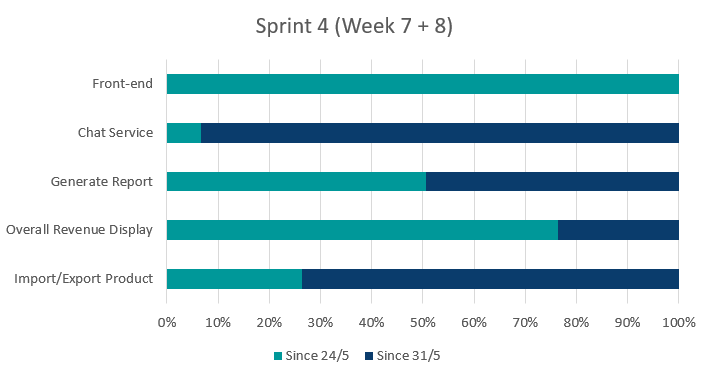

#### Sprint 5

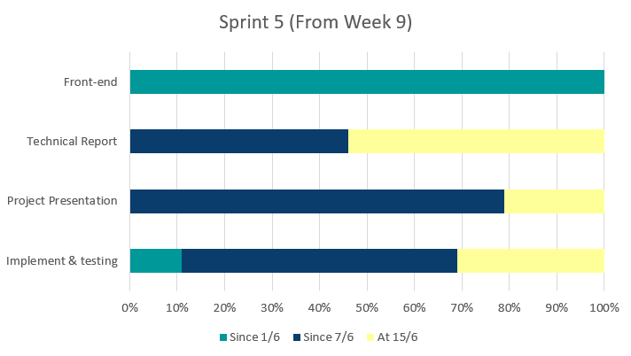

### Retrospective
#### Sprint 1
|**Time period**| From 12/04/2022  to 26/04/2022|
|------------------------- |--------------------------------------------------------------------------|
|**ID**         | 1                    |
|**Description**         | To keep track of the work progress, we set up weekly meetings to work on requirements, and to set the path for the out project, we set out to design the project architecture and draw the diagrams                    |
|**Worked on requirements**| - Design overall structure of the project - Design the project architecture |
| **Achievements** |- Having a clear vision of how the project will look like   - Having diagrams for designing other elements of the project|
| **Difficulties** |- Starting a new project with new, unfamiliar technology and framework|
| **Experience gained** |- Working with the previously new and unfamiliar framework|
#### Sprint 2
|**Time period**| From 26/04/2022 to 10/05/2022|
|------------------------- |--------------------------------------------------------------------------|
|**ID**         | 2                    |
|**Description**         | With all requirements well defined and diagrams are drawn, each member chooses their requirement to tackle, with some having completed their tasks in the same sprint                    |
|**Worked on requirements**| - Distribute tasks - Firebase - Sign in - Front-end design |
| **Achievements** |- Having a working firebase and fully implemented - With the established firebase, a log-in system is also implemented|
| **Difficulties** |None|
| **Experience gained** |- Getting more familiar with firebase|

#### Sprint 3
|**Time period**| From 10/05/2022 to 24/05/2022|
|------------------------- |--------------------------------------------------------------------------|
|**ID**         | 3                    |
|**Description**         | Continuing with the assigned tasks, the project process smoothly. This is until we encountered a problem with firestore (the built-in firebase database) that it can not accommodate the intention of managing medicine                    |
|**Worked on requirements**| - Storage management - Top bar and sidebar - Database|
| **Achievements** |- Having a working UI navigating bar - Distribute the management for drugs to ElephantSQL|
| **Difficulties** |- Unable to fully implement the designed database in the firestore - Having to get familiar with another system.|
| **Experience gained** |- Experience a new system|

#### Sprint 4
|**Time period**| From 24/05/2022 to 01/06/2022|
|------------------------- |--------------------------------------------------------------------------|
|**ID**         | 4                    |
|**Description**         | Working on the main requirements of the project                    |
|**Worked on requirements**| - Chatting service - Generating report - Getting revenue - Importing/Exporting product|
| **Achievements** |- Working chatting system with group chat capability. - Report, import/export back-end completed|
 | **Difficulties** |None<!--- One member have problem understanding the given task -->|
| **Experience gained** |None|

#### Sprint 5
|**Time period**| From 01/06/2022 to 15/06/2022|
|------------------------- |--------------------------------------------------------------------------|
|**ID**         | 5                    |
|**Description**         | As the deadline for the project approaches closer, we increased the number of meetings, connect the front-end and back-end, and finished up other requirements                    |
|**Worked on requirements**| - Implementation and testing - Presentation - Technical report|
| **Achievements** |- Having a presentable project - Finishing the presentation along with the technical report.|
 | **Difficulties** |- Having trouble with some back-end functions connecting the front-end|
| **Experience gained** |- Working under pressure to persuade the designated deadline |
## Appendix C: Gantt Chart
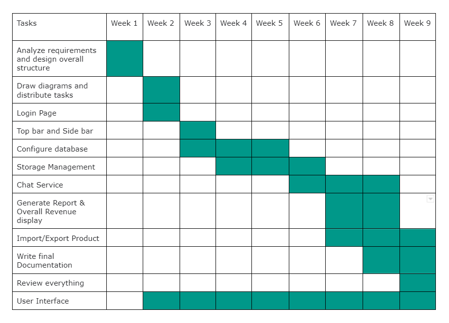